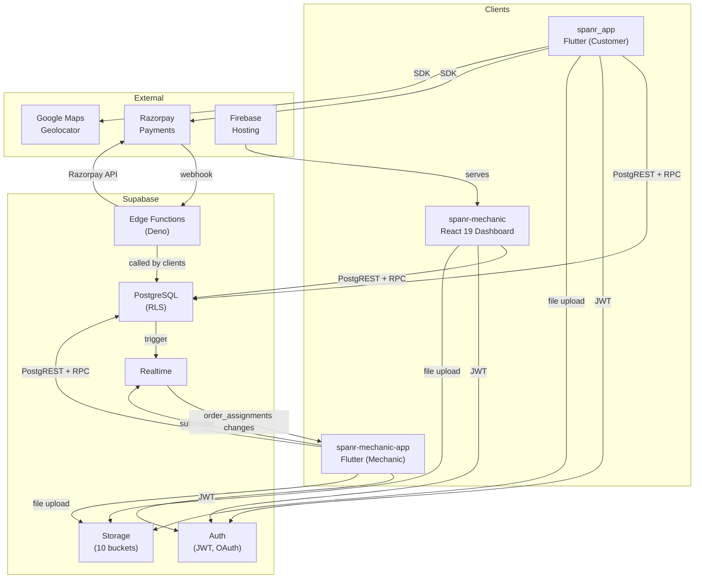
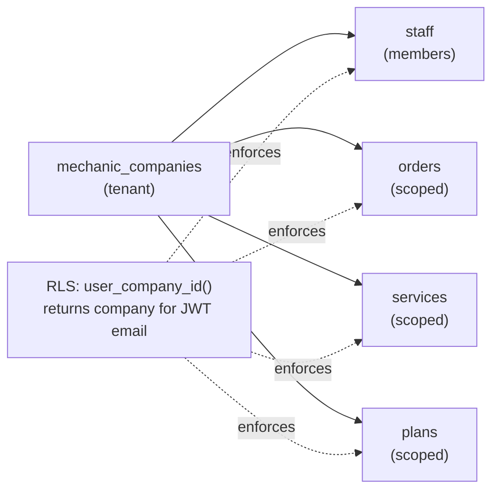
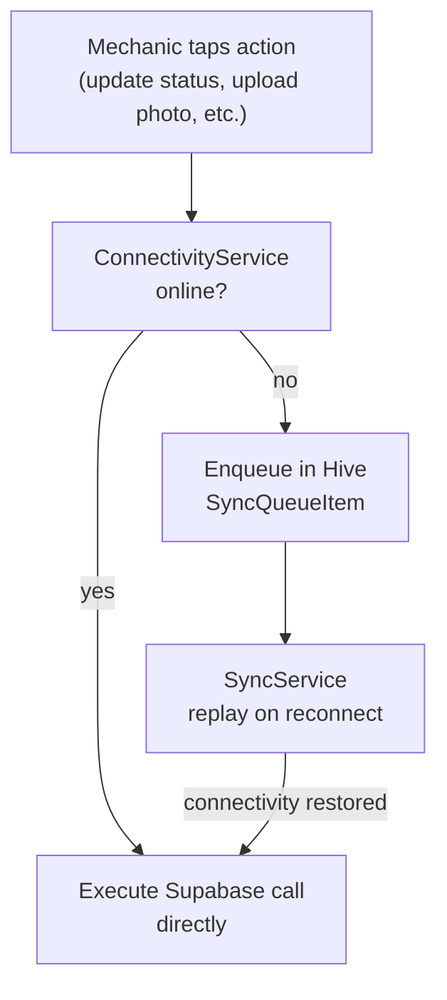

# Architecture

## Style

Layered service architecture. No microservices — single Supabase project serves all three apps. Business logic splits between:
- **PostgreSQL functions** (SECURITY DEFINER) — critical atomic operations, RLS helpers
- **Deno Edge Functions** — external integrations (Razorpay, Auth Admin API)
- **Service layer** (TS/Dart) — query composition, data mapping

---

## High-Level Diagram



---

## Multi-Tenancy Model



All queries are automatically scoped to the company of the authenticated user via RLS. The `user_company_id()` SECURITY DEFINER function is used in nearly every staff-facing policy.

---

## Request Flow — React Dashboard

```
Browser
  ↓
React Router (client-side)
  ↓
Page Component (e.g., orders.tsx)
  ↓
Custom Hook (e.g., useOrders)
  ↓
Service (e.g., orders.service.ts)
  ↓
Supabase JS Client (PostgREST or RPC)
  ↓
PostgreSQL (RLS applied, user_company_id() scopes result)
```

---

## Request Flow — Flutter Apps

```
Screen Widget
  ↓
ChangeNotifier Provider (e.g., OrderProvider)
  ↓
Service (e.g., order_service.dart)
  ↓
Supabase Flutter Client (PostgREST or RPC)
  ↓
PostgreSQL (RLS applied)
```

---

## Edge Function Invocation Patterns

| Caller | Function | Auth |
|---|---|---|
| User Flutter app | `create-razorpay-order` | Bearer JWT |
| Razorpay servers | `razorpay-webhook` | HMAC-SHA256 signature |
| Dashboard (React) | `signup-owner` | No auth (public signup) |
| Dashboard (React) | `provision-staff-auth` | Bearer JWT |
| Dashboard (React) | `reset-staff-password` | Bearer JWT |

---

## Offline Architecture (Mechanic App Only)



Operation types queued: `update_status`, `upload_inspection`, `add_part`, `save_notes`, `complete_job`.
