# Database

Supabase (PostgreSQL). All tables have RLS enabled and an `update_updated_at_column()` trigger. UUID v4 primary keys throughout.

---

## ER Diagram

```mermaid
erDiagram
    mechanic_companies ||--o{ staff : "employs"
    mechanic_companies ||--o{ services : "offers"
    mechanic_companies ||--o{ orders : "receives"
    mechanic_companies ||--|| company_ratings : "has"
    mechanic_companies ||--o{ company_certifications : "has"
    mechanic_companies ||--o{ company_specializations : "has"
    mechanic_companies ||--o{ company_documents : "uploads"

    services ||--o{ plans : "contains"
    plans ||--o{ plan_fuel_types : ""
    plans ||--o{ plan_features : ""
    plans ||--o{ plan_faqs : ""
    plans ||--o{ plan_service_outcomes : ""
    plans ||--o{ plan_additional_services : ""
    plans ||--o{ plan_steps : ""

    users ||--o{ orders : "places"
    users ||--o{ vehicles : "owns"
    users ||--o{ images : "uploads"

    vehicles ||--o{ orders : "used in"

    orders ||--|| payments : "has"
    orders ||--o{ order_assignments : "assigned via"
    orders ||--o{ order_history : "tracks"
    orders ||--o{ order_before_images : "has"
    orders ||--o{ order_after_images : "has"
    orders ||--o| order_service_details : "has"
    orders ||--o{ parts_replaced : "has"
    orders ||--o{ inspection_images : "has"
    orders ||--o| vehicle_service_history : "creates"

    staff ||--o{ order_assignments : "receives"
    staff ||--|| staff_profiles : "has"
    staff ||--o{ staff_access : "has"
    staff ||--o{ staff_skills : "has"
    staff ||--o{ staff_certificates : "has"
    staff ||--o{ staff_courses : "has"
    staff ||--o{ staff_attendance : "logs"

    vehicle_service_history ||--o{ parts_replaced : "references"
    vehicle_service_history ||--o{ inspection_images : "references"
```



---

## Tables

### Users & Identity

**`users`** — Customer app end users
| Column | Type | Notes |
|---|---|---|
| `id` | UUID PK | = `auth.uid()` |
| `name` | TEXT | |
| `email` | TEXT | |
| `phone` | TEXT | |
| `created_at` | TIMESTAMPTZ | |
| `updated_at` | TIMESTAMPTZ | auto-updated |

**`staff`** — Dashboard owners + mechanic employees
| Column | Type | Notes |
|---|---|---|
| `id` | UUID PK | |
| `company_id` | UUID FK | → mechanic_companies |
| `email` | TEXT | Owner real email OR `<91phone>@spanr.staff` |
| `name` | TEXT | |
| `phone` | TEXT | |
| `enabled` | BOOLEAN | |
| `auth_user_id` | UUID | → auth.users.id |

Unique indexes: `lower(email) WHERE enabled=true`, `(company_id, phone) WHERE phone IS NOT NULL`

---

### Company

**`mechanic_companies`**
| Column | Type |
|---|---|
| `id` | UUID PK |
| `company_name` | TEXT NOT NULL |
| `address_line_1/2`, `landmark`, `city`, `state`, `pincode` | TEXT |
| `phone_number`, `phone`, `email` | TEXT |
| `logo` | TEXT (URL) |
| `images` | TEXT[] (URLs) |
| `latitude`, `longitude` | DOUBLE PRECISION |

**`company_ratings`** (1:1 per company)
- `professionalism`, `timeliness`, `quality` NUMERIC
- `rating` NUMERIC (0–5), `ratings_count` INTEGER

**`company_certifications`** — `(company_id, certification_name)`

**`company_specializations`** — `(company_id, specialization_name)`

**`company_documents`** — KYC
| Column | Values |
|---|---|
| `document_type` | `gst_certificate \| pan_card \| utility_bill` |
| `verified` | `pending \| verified \| rejected` |
| `rejection_reason` | TEXT |

Unique: `(company_id, document_type)`

---

### Services & Plans

**`services`** — `(id, company_id, name, description, icon_url, is_active)`

**`plans`**
| Column | Type/Values |
|---|---|
| `vehicle_type` | `car \| bike` |
| `location_type` | enum |
| `duration` | INTEGER (minutes) |
| `base_price`, `tax` | NUMERIC |
| `warranty`, `guarantee`, `badge` | TEXT |

Related: `plan_fuel_types`, `plan_features`, `plan_faqs`, `plan_service_outcomes`, `plan_additional_services`, `plan_steps`

---

### Orders

**`orders`**
| Column | Type/Notes |
|---|---|
| `status` | `order_status` enum (see below) |
| `contact_name/phone/email/address` | TEXT — snapshot at booking time |
| `service_latitude/longitude` | DOUBLE PRECISION |
| `scheduled_service_date` | TIMESTAMPTZ |

Index: `(company_id, status, scheduled_service_date DESC)`

**`order_status` enum:**
```
created → accepted → assigned → in_progress → waiting_for_parts → ready_for_delivery → completed
                                                                                      → cancelled
                                                                                      → dispute
```

**`order_assignments`**
| Column | Notes |
|---|---|
| `status` | `active \| reassigned \| completed \| cancelled` |
| Partial unique index | `(order_id) WHERE status = 'active'` — one active assignment per order |

**`order_history`** — Auto-populated by trigger on status change

---

### Payments

**`payments`**
| Column | Notes |
|---|---|
| `method` | `payment_method` enum |
| `status` | `unpaid \| processing \| paid \| failed` |
| `razorpay_order_id`, `razorpay_payment_id`, `razorpay_signature` | TEXT |

**`payment_webhook_events`** — `event_id TEXT UNIQUE` (idempotency key)

---

### Vehicle & History

**`vehicles`** — `(user_id, name, make, model, year, color, license_plate, vehicle_type, is_primary, is_indian_licensed)`

**`vehicle_service_history`** — Denormalized snapshot created when job completes
- Includes: vehicle details, customer name, mechanic name, company name, odometer, services performed
- Links to `parts_replaced` and `inspection_images` via `service_history_id`

**`inspection_images`**
| Column | Values |
|---|---|
| `type` | `before \| after` |
| `angle` | `front \| back \| left \| right \| other` |

---

## Views

| View | Purpose |
|---|---|
| `company_profiles` | Companies with aggregated certifications + specializations |
| `order_details` | Full join: orders + users + vehicles + plans + payments |
| `staff_workload` | Per staff: active job count + availability status |

---

## Key Database Functions (SECURITY DEFINER)

| Function | Purpose |
|---|---|
| `user_company_id()` | Company UUID for the calling JWT's email — RLS helper |
| `auth_staff_id()` | Staff UUID for the calling JWT — RLS helper |
| `assign_order_to_staff(order_id, staff_id, notes)` | Atomically reassign + set order to `assigned` |
| `complete_job(order_id, staff_id, odometer, service_notes, services_performed)` | Full job completion: creates history, links records, closes assignment |
| `complete_staff_password_change()` | Clears `must_change_password` for calling staff |
| `vehicle_on_company_order(vehicle_id)` | Boolean — used in RLS for staff vehicle access |
| `vehicle_on_assigned_order(vehicle_id)` | Boolean — used in RLS for mechanic vehicle access |
| `get_plan_details(plan_uuid)` | Returns full plan JSON including all child tables |

---

## Storage Buckets

| Bucket | Public | Max Size | Purpose |
|---|---|---|---|
| `company-logos` | Yes | — | Company logos |
| `company-images` | Yes | — | Company gallery |
| `company-documents` | **No** | — | KYC docs (signed URLs, 1hr expiry) |
| `service-icons` | Yes | — | Service icons |
| `plan-images` | Yes | — | Plan outcome images |
| `staff-photos` | Yes | 5MB | Staff profile photos |
| `staff-certificates` | Yes | 10MB | Certificate files |
| `orders` | Yes | 10MB | Order before/after images |
| `inspection-images` | Yes | 10MB | Mechanic inspection photos |
| `vehicle-images` | Yes | — | User vehicle photos |

---

## Migrations

`spanr-mechanic/sql/migrations/` — 039 numbered files (001–039).

Naming pattern: `NNN_description.sql`

Notable migrations:
- `001–010`: Core tables (companies, users, staff, services, plans)
- `011–020`: Orders, payments, assignments, history
- `021–030`: Inspection images, parts replaced, service details
- `031–039`: Refinements, indexes, RLS policies
