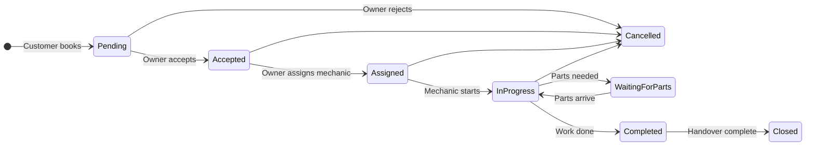

# SPANR Gap Analysis Report

**Date:** June 10, 2026  
**Scope:** Mechanic Shop Owner Dashboard (Web) + Mechanic Employee App (Flutter)  
**Compared against:** Business requirements (Zomato-style vehicle service platform)

---

## Executive Summary

The project is a **functional MVP** with three main components:

| Component | Tech | Status |
|-----------|------|--------|
| **Customer App** | Flutter (`spanr_app`) | ~70% built — booking, payments, vehicles |
| **Owner Dashboard** | React (`spanr-mechanic`) | ~55% built — profile, catalog, orders, staff |
| **Employee App** | Flutter | **0% — does not exist** |

**Backend:** Supabase-only (Postgres + Auth + Storage + 2 Edge Functions). No separate API server.

**Core trust requirement (permanent digital service records):** Partially addressed via order images, `order_service_details`, and job card JSON — but not structured as a first-class vehicle service history system.

**Estimated overall gap:** ~45% of required functionality is missing or only stubbed.

---

## 1. Feature Gap Analysis

### 1.1 Shop Profile Management

| Requirement | Status | Notes |
|-------------|--------|-------|
| Shop Name | ✅ Implemented | `mechanic_companies.company_name` |
| Shop Logo | ✅ Implemented | Upload to `company-logos` bucket |
| Shop Images/Gallery | ✅ Implemented | `mechanic_companies.images[]` |
| Owner Name | ⚠️ Partial | Staff name on onboarding; no dedicated owner field |
| Phone Number | ✅ Implemented | `phone` + `phone_number` |
| Email | ✅ Implemented | |
| Address | ✅ Implemented | Full address fields |
| Location (Google Maps) | ⚠️ Partial | Lat/long + browser geolocation; no embedded Google Maps picker |
| Years of Experience | ❌ Missing | No DB column or UI |
| Number of Employees | ❌ Missing | No DB column or UI |
| About Shop | ❌ Missing | No description/about field |
| Expertise/Specialization | ✅ Implemented | `company_specializations` table |
| Working Hours | ❌ Missing | No schedule model |
| Open/Closed Status | ❌ Missing | No availability toggle |

**Priority:** Working hours + open/closed = **Must Have** for marketplace discovery. Years of experience, employee count, about = **Nice to Have**.

---

### 1.2 Ratings & Reviews

| Requirement | Status | Notes |
|-------------|--------|-------|
| View customer ratings | ❌ Missing (Dashboard) | `company_ratings` exists; shown in customer app only |
| View reviews | ❌ Missing | No `reviews` table |
| Average rating calculation | ⚠️ Partial | Aggregated in `company_ratings`; no per-order reviews |
| Review management | ❌ Missing | No respond/flag/moderate UI |

**Priority:** **Must Have** for trust; schema needs a `reviews` table.

---

### 1.3 Service Management

Current model differs from requirements:

| Requirement Model | Current Model |
|-------------------|---------------|
| **Individual Services** (Clutch, Brake, Oil Change — each with price, duration, images) | **Services** = categories (Car/Bike) with icon only |
| **Service Packages** (Basic/Premium/Full — bundled services) | **Plans** = rich marketing packages tied to a service category |

| Individual Service Fields | Status |
|---------------------------|--------|
| Name, Description, Price, Duration, Images | ❌ Missing as atomic units |
| Package Name, Included Services, Description, Price, Duration | ⚠️ Partial | Plans have price/duration; "included services" = `plan_additional_services` (text list, not FK links) |

**Priority:** Restructure catalog = **Must Have** if customers must pick individual services à la carte.

---

### 1.4 Booking Management

| Requirement | Status | Notes |
|-------------|--------|-------|
| New booking notifications | ❌ Missing | No push/in-app/realtime |
| View booking details | ✅ Implemented | `orders`, `order_detail` |
| Accept/Reject booking | ✅ Implemented | `created` → `accepted` / `cancelled` |
| Customer information | ✅ Implemented | Contact fields on order |
| Vehicle information | ✅ Implemented | Linked `vehicles` |
| Selected services/packages | ✅ Implemented | Via `plan_id` |

**Booking status mapping:**

| Required | Current | Gap |
|----------|---------|-----|
| Pending | `created` | ✅ Equivalent |
| Accepted | `accepted` | ✅ |
| Assigned | — | ❌ Missing |
| In Progress | `in_progress` | ✅ |
| Waiting for Parts | — | ❌ Missing |
| Completed | `completed` | ✅ |
| Closed | — | ❌ Missing (or merge with completed) |
| Cancelled | `cancelled` | ✅ |
| — | `ready_for_delivery`, `dispute` | Extra statuses |

**Priority:** Assigned + Waiting for Parts = **Must Have**. Notifications = **Must Have**.

---

### 1.5 Employee Management

| Requirement | Status | Notes |
|-------------|--------|-------|
| Add/Edit/Deactivate employee | ✅ Implemented | `staff` CRUD; `enabled` flag |
| View workload | ❌ Missing | No assignment or metrics |
| View skills/expertise | ❌ Missing | Staff = name, email, permissions only |
| Phone | ❌ Missing | |
| Experience | ❌ Missing | |
| Skills | ❌ Missing | |
| Profile Photo | ❌ Missing | |
| Status (Available/Busy) | ❌ Missing | |

**Priority:** Basic CRUD = done. Skills + availability + workload = **Must Have** for job assignment.

---

### 1.6 Job Assignment

| Requirement | Status |
|-------------|--------|
| Assign jobs to mechanics | ❌ Missing |
| Reassign jobs | ❌ Missing |
| Track progress | ⚠️ Partial | Order-level status only; no assignee |
| Skill-based assignment | ❌ Missing |

**Priority:** **Must Have** — core owner ↔ employee workflow.

---

### 1.7 Vehicle Service History (Trust & Transparency)

| Requirement | Status | Notes |
|-------------|--------|-------|
| Vehicle Number, Model, Customer | ⚠️ Partial | Per-order only |
| Service Date | ⚠️ Partial | `order_date` / `scheduled_service_date` |
| Odometer Reading | ⚠️ Partial | Job card JSON `kms_run` only |
| Services Performed | ⚠️ Partial | Plan name + free-text description |
| Parts Replaced | ⚠️ Partial | `parts_used` TEXT field |
| Before/After Photos | ⚠️ Partial | `order_before_images`, `order_after_images` |
| Full cross-order history | ❌ Missing | No `vehicle_service_history` entity |
| Employee who worked | ❌ Missing | `order_after_images.uploaded_by` only |
| Permanent digital record | ⚠️ Partial | Data scattered across orders |

**Priority:** **Must Have** — stated as the most important business requirement.

---

### 1.8 Parts Tracking

| Requirement | Status |
|-------------|--------|
| Part Name, Number, Brand, Cost, Quantity | ❌ Missing (structured) |
| Replacement Date, Vehicle KM | ❌ Missing |
| Replacement history | ❌ Missing |

Current: single `parts_used` text field on `order_service_details`.

**Priority:** **Must Have** for trust requirement.

---

### 1.9 Reports & Analytics

| Requirement | Status |
|-------------|--------|
| Total Bookings | ⚠️ Partial | Count on dashboard |
| Completed Jobs | ⚠️ Partial | Status filter count |
| Revenue | ❌ Missing | No aggregation UI |
| Active Customers | ❌ Missing | |
| Employee Performance | ❌ Missing | |
| Top Services | ❌ Missing | |
| Monthly Reports | ❌ Missing | |

`@mantine/charts` and `recharts` are installed but unused.

**Priority:** Basic revenue + booking reports = **Must Have**; advanced analytics = **Nice to Have**.

---

### 1.10 Multi-Language Support

| Requirement | Status |
|-------------|--------|
| English | ✅ Default only |
| Hindi, Telugu, Tamil | ❌ Missing |
| i18n-ready architecture | ❌ Missing | No `react-i18next` / `flutter_localizations` |

**Priority:** **Nice to Have** (Phase 3).

---

### 1.11 Mechanic Employee App (Flutter)

| Feature Area | Status |
|--------------|--------|
| Entire Flutter employee app | ❌ **Not started** |
| Authentication | ❌ | Exists only in customer app |
| Assigned Jobs | ❌ | |
| Job Workflow | ❌ | Partially in React dashboard |
| Before/After Inspection (4 angles) | ❌ | Customer uploads before photos; mechanic uploads after on web |
| Parts Replacement UI | ❌ | |
| Notifications | ❌ | |
| Offline Support | ❌ | |

Employee workflows today live in the **React web dashboard**, not a dedicated mobile app.

**Priority:** **Must Have** for field mechanics.

---

## 2. Missing Pages / Screens

### Owner Dashboard (React) — Missing Routes

| Page | Route (Suggested) | Priority |
|------|-------------------|----------|
| Reviews & Ratings | `/reviews` | Must Have |
| Reports & Analytics | `/reports` | Must Have |
| Vehicle Service History | `/vehicles/:plate/history` | Must Have |
| Parts Inventory / History | `/parts` | Must Have |
| Job Assignment Board | `/jobs` or tab on order detail | Must Have |
| Working Hours Config | `/company-profile/hours` | Must Have |
| Individual Services Catalog | `/services/items` | Must Have |
| Notifications Center | `/notifications` | Nice to Have |
| Settings (i18n) | `/settings` | Nice to Have |

### Employee App (Flutter) — All Screens Missing

| Screen | Priority |
|--------|----------|
| Splash | Must Have |
| Login | Must Have |
| Forgot Password | Must Have |
| Home / Assigned Jobs List | Must Have |
| Job Detail | Must Have |
| Before Inspection (4 photos) | Must Have |
| Service Execution (notes, media) | Must Have |
| Parts Replacement Form | Must Have |
| After Inspection (4 photos) | Must Have |
| Job Completion (KM, final notes) | Must Have |
| Profile | Nice to Have |
| Notifications | Must Have |
| Offline Sync Status | Must Have |

---

## 3. Missing APIs

No custom REST API exists; gaps are **Supabase tables, RPC, Edge Functions, and RLS**.

| API Capability | Type | Priority |
|----------------|------|----------|
| `assign_order_to_staff(order_id, staff_id)` | RPC | Must Have |
| `get_staff_workload(company_id)` | RPC | Must Have |
| `get_vehicle_service_history(vehicle_id)` | RPC/View | Must Have |
| `create_service_record(order_id)` | RPC (on complete) | Must Have |
| `get_company_analytics(company_id, date_range)` | RPC | Must Have |
| `submit_review(order_id, rating, text)` | Table + RLS | Must Have |
| `send_push_notification(user_id, payload)` | Edge Function + FCM | Must Have |
| `get_individual_services(company_id)` | Table query | Must Have |
| `create_service_package(services[])` | Table + junction | Must Have |
| Realtime: `orders` channel | Supabase Realtime | Must Have |
| Fix `orders` storage bucket RLS | Storage policy | Must Have |
| Fix `staff_access` RLS policies | Migration | Must Have |
| Secure `payment_webhook_events` | Enable RLS | Must Have |

---

## 4. Missing Database Tables

| Table | Purpose | Priority |
|-------|---------|----------|
| `individual_services` | Atomic services (name, price, duration, images) | Must Have |
| `service_packages` | Package definitions | Must Have |
| `package_services` | M:N package ↔ individual service | Must Have |
| `order_assignments` | `order_id`, `staff_id`, `assigned_at`, `assigned_by` | Must Have |
| `staff_skills` | `staff_id`, `skill_name` | Must Have |
| `staff_profiles` | phone, experience, photo_url, status enum | Must Have |
| `vehicle_service_history` | Immutable service record per completed job | Must Have |
| `parts_replaced` | Structured parts per order/history | Must Have |
| `reviews` | `order_id`, `user_id`, `rating`, `review_text` | Must Have |
| `company_working_hours` | Day, open/close times | Must Have |
| `company_availability` | `is_open` toggle | Must Have |
| `inspection_images` | Typed: front/back/left/right, before/after | Must Have |
| `notifications` | In-app notification queue | Must Have |
| `device_tokens` | FCM tokens for push | Must Have |
| `parts_inventory` | Stock catalog (optional) | Nice to Have |

### Schema Changes to Existing Tables

| Table | Change | Priority |
|-------|--------|----------|
| `mechanic_companies` | Add `about`, `years_experience`, `employee_count`, `owner_name` | Nice Have / Must Have |
| `orders` | Add `assigned_staff_id`, extend `order_status` enum | Must Have |
| `order_status` enum | Add `assigned`, `waiting_for_parts`, `closed`; map `created`→pending | Must Have |
| `staff` | Add `phone`, `experience_years`, `photo_url`, `status` enum | Must Have |
| `order_service_details` | Replace `parts_used` TEXT with FK to `parts_replaced` | Must Have |

---

## 5. Missing Models

### React Dashboard (`spanr-mechanic/src/types/`)

| Model | Priority |
|-------|----------|
| `IndividualService`, `ServicePackage`, `PackageService` | Must Have |
| `OrderAssignment`, `StaffSkill`, `StaffProfile` | Must Have |
| `VehicleServiceHistory`, `PartReplaced`, `InspectionImage` | Must Have |
| `Review`, `CompanyWorkingHours`, `Notification` | Must Have |
| `AnalyticsSummary`, `EmployeePerformance` | Must Have |
| `CompanyAvailability` | Must Have |

### Flutter Employee App (new project)

| Model | Priority |
|-------|----------|
| `StaffUser`, `AssignedJob`, `JobWorkflowStatus` | Must Have |
| `InspectionSession`, `InspectionImage` | Must Have |
| `PartReplacement`, `ServiceNote` | Must Have |
| `VehicleServiceRecord` | Must Have |
| `NotificationModel`, `SyncQueueItem` | Must Have |

### Flutter Customer App (`spanr_app`) — gaps

| Model | Priority |
|-------|----------|
| `ReviewModel` | Must Have |
| `VehicleServiceHistoryModel` | Must Have |
| `IndividualServiceModel` (if à la carte booking) | Must Have |

---

## 6. Missing Flutter Screens (Employee App)

**Critical:** No employee Flutter project exists. Recommended new app: `spanr-mechanic-app`.

```
spanr-mechanic-app/lib/
├── main.dart
├── config/
│   ├── app_router.dart
│   └── supabase_config.dart
├── auth/
│   ├── models/staff_user.dart
│   ├── services/auth_service.dart
│   └── screens/
│       ├── login_screen.dart          ❌
│       └── forgot_password_screen.dart ❌
├── jobs/
│   ├── models/
│   │   ├── assigned_job.dart          ❌
│   │   ├── job_status.dart            ❌
│   │   └── inspection_image.dart      ❌
│   ├── services/jobs_service.dart     ❌
│   ├── providers/jobs_provider.dart   ❌
│   └── screens/
│       ├── jobs_list_screen.dart      ❌
│       ├── job_detail_screen.dart     ❌
│       ├── before_inspection_screen.dart ❌
│       ├── service_execution_screen.dart ❌
│       ├── parts_replacement_screen.dart ❌
│       ├── after_inspection_screen.dart  ❌
│       └── job_completion_screen.dart    ❌
├── sync/
│   ├── models/sync_queue_item.dart    ❌
│   ├── services/offline_sync_service.dart ❌
│   └── local/hive_boxes.dart          ❌
└── notifications/
    ├── services/push_service.dart     ❌
    └── screens/notifications_screen.dart ❌
```

---

## 7. Recommended Folder Structure

### Monorepo Layout (Target)

```
spanr_project/
├── spanr_app/                    # Customer Flutter app (exists)
├── spanr-mechanic/               # Owner Dashboard React (exists)
├── spanr-mechanic-app/           # Employee Flutter app (NEW)
├── packages/
│   └── shared_models/            # Optional: shared Dart types
├── supabase/                     # Consolidate migrations here
│   ├── migrations/
│   ├── functions/
│   │   ├── create-razorpay-order/   (exists)
│   │   ├── razorpay-webhook/        (exists)
│   │   └── send-notification/       (NEW)
│   └── seed/
└── docs/
    └── GAP_ANALYSIS.md
```

### Owner Dashboard Additions

```
spanr-mechanic/src/
├── reviews/          # NEW module
├── reports/          # NEW module
├── assignments/      # NEW module
├── vehicle-history/  # NEW module
├── parts/            # NEW module
├── services/
│   ├── individual-services.service.ts  # NEW
│   └── packages.service.ts             # NEW
└── pages/
    ├── reviews.tsx
    ├── reports.tsx
    ├── vehicle_history.tsx
    └── parts.tsx
```

### Database Migration Convention

```
supabase/migrations/
├── 025_individual_services_and_packages.sql
├── 026_order_assignments_and_staff_profiles.sql
├── 027_vehicle_service_history.sql
├── 028_parts_replaced.sql
├── 029_reviews_and_working_hours.sql
├── 030_inspection_images.sql
├── 031_notifications.sql
└── 032_fix_rls_gaps.sql
```

---

## 8. Implementation Roadmap

### Phase 1 — MVP (8–10 weeks)

**Goal:** Trust & transparency + core owner ↔ employee workflow.

| # | Deliverable | Components |
|---|-------------|------------|
| 1 | Fix security gaps | RLS for `staff_access`, `orders` storage, `payment_webhook_events` |
| 2 | Extend order workflow | Statuses: `assigned`, `waiting_for_parts`; assignment fields |
| 3 | Staff profiles | Phone, skills, photo, availability |
| 4 | Job assignment | Owner UI + `order_assignments` table |
| 5 | Structured parts | `parts_replaced` table; replace free-text field |
| 6 | Vehicle service history | `vehicle_service_history` auto-created on order complete |
| 7 | Inspection images | Typed before/after (4 angles) |
| 8 | Employee Flutter app v1 | Auth, assigned jobs, workflow, inspections, parts, completion |
| 9 | Basic offline sync | Hive/SQLite queue for employee app |
| 10 | Realtime order notifications | Supabase Realtime on dashboard |

**Phase 1 exit criteria:** Mechanic completes a job on mobile; owner sees assignment and history; vehicle has a permanent record with photos, parts, KM, and employee.

---

### Phase 2 — Growth (6–8 weeks)

| # | Deliverable | Priority |
|---|-------------|----------|
| 1 | Individual services + packages | Must Have |
| 2 | Reviews & ratings (customer submit + owner view) | Must Have |
| 3 | Reports dashboard (revenue, bookings, top services) | Must Have |
| 4 | Push notifications (FCM) | Must Have |
| 5 | Working hours + open/closed | Must Have |
| 6 | Employee workload & performance views | Must Have |
| 7 | Google Maps picker (owner profile) | Nice to Have |
| 8 | Permission enforcement in dashboard | Must Have |
| 9 | Customer app: service history view | Must Have |
| 10 | Customer app: submit reviews | Must Have |

---

### Phase 3 — Scale (6+ weeks)

| # | Deliverable | Priority |
|---|-------------|----------|
| 1 | Multi-language (EN, HI, TE, TA) | Nice to Have |
| 2 | Admin panel | Future |
| 3 | CRM panel | Future |
| 4 | Parts inventory / stock management | Nice to Have |
| 5 | Advanced analytics (monthly exports, employee leaderboard) | Nice to Have |
| 6 | Skill-based auto-assignment suggestions | Nice to Have |
| 7 | Customer app enhancements | Ongoing |

---

## Priority Matrix Summary

| Category | Must Have | Nice to Have |
|----------|-----------|--------------|
| **Shop Profile** | Working hours, open/closed | Years experience, employee count, about |
| **Services** | Individual services + packages model | — |
| **Bookings** | Assignment, waiting for parts, notifications | Closed status |
| **Employees** | Skills, phone, photo, availability, workload | — |
| **Trust/History** | Full vehicle service history, structured parts | — |
| **Employee App** | Entire app | Profile screen |
| **Reports** | Revenue, bookings, top services | Employee leaderboard |
| **Reviews** | View + submit flow | Review management/moderation |
| **i18n** | — | All 4 languages |

---

## Existing Strengths to Build On

1. **Solid Supabase foundation** — 26 tables, payments (Razorpay), order lifecycle, storage buckets.
2. **Owner dashboard MVP** — Company onboarding, services/plans CRUD, order management, job card, staff CRUD.
3. **Customer app** — End-to-end booking with before photos and Razorpay.
4. **Order audit trail** — `order_history` trigger on status changes.
5. **Rich plan model** — Features, FAQs, steps, outcomes (good base for packages).

---

## Critical Risks

| Risk | Impact | Mitigation |
|------|--------|------------|
| No employee mobile app | Field mechanics cannot use the system | Phase 1 priority |
| Parts as free text | Cannot meet trust/transparency requirement | `parts_replaced` table in Phase 1 |
| No job assignment | Owner cannot delegate | `order_assignments` in Phase 1 |
| RLS gaps (`staff_access`, `orders` bucket) | Production security issues | Fix before launch |
| Service model mismatch | Customer cannot book individual repairs | Phase 2 catalog restructure |
| Type drift across apps | Runtime bugs | Shared enum definitions / code generation |

---

## Appendix: Current vs Required Status Flow



**Current implementation:** `created` → `accepted` → `in_progress` → `ready_for_delivery` → `completed` (no `assigned`, `waiting_for_parts`, or `closed`).

---

## Appendix: Existing Features Already Implemented

### Owner Dashboard (`spanr-mechanic`)

- Authentication (login, signup, logout, session, onboarding gate)
- Company profile CRUD (general, location, photos, certifications, specializations, KYC documents)
- Services CRUD with icon upload
- Plans CRUD with nested data (features, FAQs, steps, outcomes, additional services)
- Orders list (search, filter, pagination, stats)
- Order detail (customer, vehicle, payment, location, status workflow)
- Before/after service images
- Service details form (description, parts-used text, labor, charges)
- Job card (save + print preview)
- Staff CRUD + permission assignment
- Dashboard summary counts
- User profile page

### Customer App (`spanr_app`)

- Auth (email/password, Google OAuth)
- Nearby mechanics browse and search
- Mechanic detail with services/plans
- Addresses CRUD with map picker
- Vehicles CRUD with image upload
- Booking flow (vehicle → before photos → checkout → Razorpay → confirmation)
- Orders list and detail with status timeline
- Payment processing via Razorpay edge functions

### Backend (Supabase)

- 26 tables, 2 views, 9 RPC/trigger functions
- Razorpay payment flow (edge functions + webhook)
- 7 storage buckets
- RLS on most tables (with known gaps documented above)
